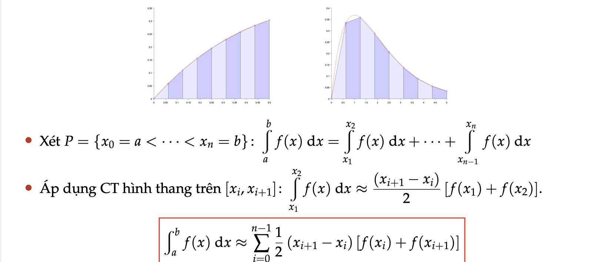
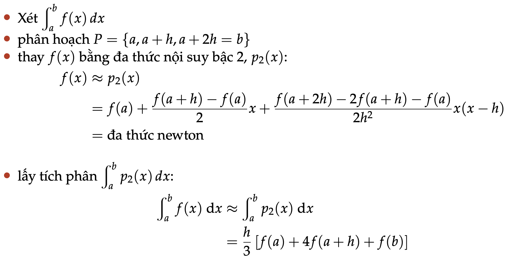
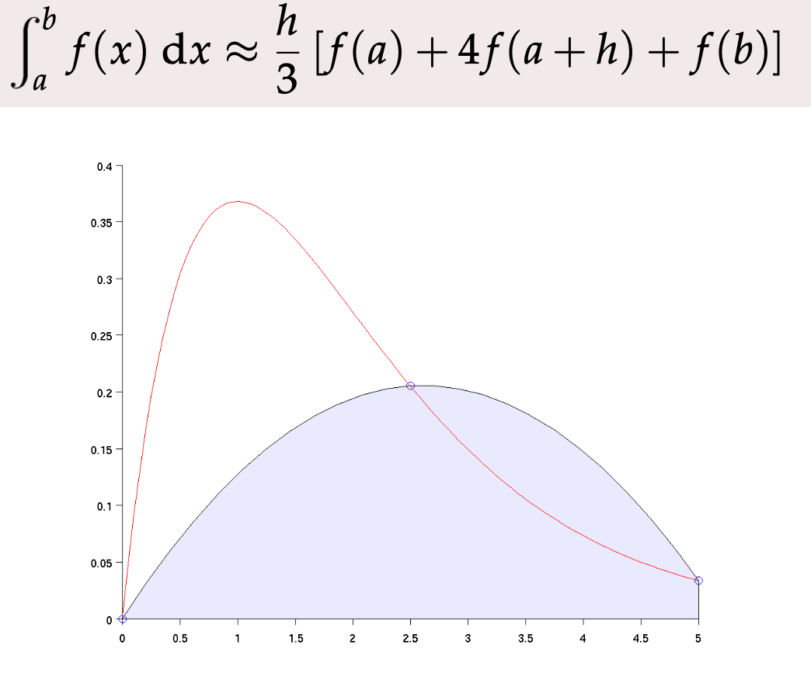
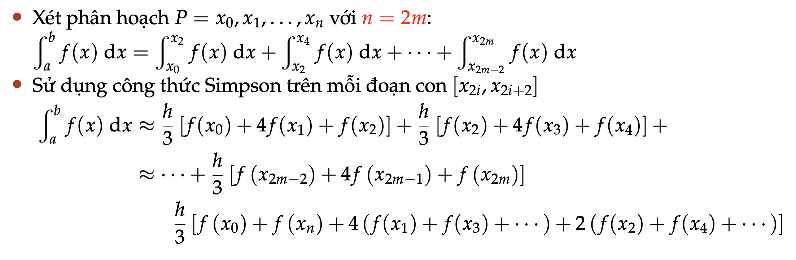
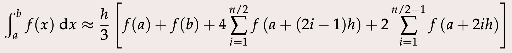

# Đạo Hàm: 

- Cách tính đạo hàm của hàm `f(x)` tại một giá trị `x` bất kì (`f'(x)`).
  
    - `f'(x) = (f(x+h) - f(x))/h`:
      - Trong đó: `h` là độ chính xác của phép toán, `h` thường là một số rất rất bé.

# Tính tích phân bằng phương pháp hình thang: 

- Công thức tổng **Riamann** 
    

- Xây dựng công thức hình thang: 
    
    

=> Để tính tích phân theo công thức hình thang, chúng ta sẽ chia miền tích phần thành thật nhiều hình thang thì sai số sẽ càng nhỏ, rôì dùng vòng lập để tính.

# Tính tích phân bằng phương pháp Simson: 

- *Chú ý việc chia phần tích phân thành nhiều phần nhỏ phải là một số chẵn.*
  
