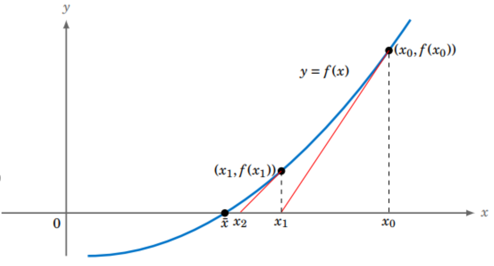

# Giải phương trình bằng phương pháp chia đôi

[Code](gpt_chia_doi.cpp)
[Lí Thuyết](slide_bai21_ppchiadoi.pdf)

# Giải phương trình bằng phương pháp lập đơn

[Code](gpt_lap_don.cpp)

# Giải phương trình bằng phương pháp newton

- Phương pháp tiếp tuyến của đường cong `y = f(x)` tại điểm `M(x, f(x))` có dạng `y = f'(x0)(x - x0) + f(x0)`.
  

Ta tính được: `x1 = x0 - f(x0)/f'(x0)`

-> Từ đây lập tìm nghiệm. 