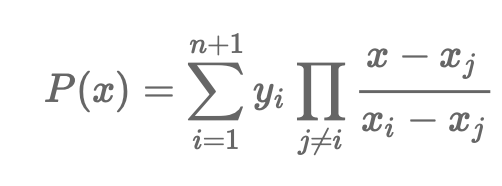

# Nội Suy

- Chúng ta có đa thức:  `P(x) = 2x^2 - 3x + 3`
- Chúng ta dễ dàng tính được: `P(1) = 2, P(2) = 5, P(3) = 12, ...`
- *Chúng ta đặt ra câu hỏi*, nếu chúng ta có `P(1) = 2, P(2) = 5, P(3) = 12` thì chúng ta có thể tìm ra hàm `P(x)` hay không ?

## Nhận xét:
- Nếu chúng ta **không hạn chế** về bậc của `P(x)` sẽ tồn tại **vô số** các đa thức `P(x)` thoả mãn điều kiện: `P(1) = 2, P(2) = 5, P(3) = 12`

# Nội suy Newton

- Nếu `x1, x2, x3, x4, x5, x6, ..., xn` là `n` số thực khác nhau, vầ `y1, y2, y3, ... yn` là `n` số thực bất kì. Thì sẽ tồn tại **duy nhất** một đa thức `P(x)` có bậc bằng n hoặc nhỏ hơn n thoả mãn điều kiện: 
    `P(x1) = y1, P(x2) = y2, P(x3) = y3, ..., P(xn) = yn`

- Chúng ta sẽ tìm được đa thức `P(x)` có dạng sau: 
`P(x) = a1 + a2(x - x1) + a3(x - x1)(x - x2) + ... + an(x - x1)(x - x2)...(x - xn-1)`

- Để xử lí bài toán tìm kiếm các giá trị `a1, a2, a3, a4, a5, ..., an` chúng ta sẽ cần sử dụng kiến thức tỉ sai phân, chúng ta sẽ lập bảng tỉ sai phân và lấy được các giá trị cần tìm `a1, a2, a3, a4, a5, ..., an`.

[Code](noi_suy_newton.cpp)

# Nội suy Lagrange

- Đối với một đa thức `f(x)` bất kì, nếu `f(u) = 0` thì `u` là một nghiệm của đa thức, cho nên `f(x)` sẽ chia hết cho `x - u`. Ta có thể suy ra, `f(x)` có dạng: `f(x) = (x - u)*g(x)`.
- Sử dụng bài toán này để giải quyết vấn đề:   
    - Tìm đa thức `A(x)`, biết `A(1) = 1, A(2) = 0, A(3) = 0`

        => `A(x)` có dạng: `A(x) = a(x - 2)(x - 3)`
        Xử lí dữ liệu `A(1) = 1`, thì ta tính được `a = 1/((1 - 2)*(1 - 3))`
        => `A(x) = [(x - 2)(x - 3)]/[(1 - 2)*(1 - 3)]`
    - Tương tự chúng ta tìm đa thức `B(x)`, biết `B(1) = 0, B(2) = 1, B(3) = 0` và tìm đa thức `C(x)`, biết `C(1) = 0, C(2) = 0, C(3) = 1`.
        => `B(x) = [(x - 1)(x - 3)]/[(2 - 1)*(2 - 3)]` và `C(x) = [(x - 1)(x - 2)]/[(3 - 1)*(3 - 2)]`
- Bây giờ xử lí bài toán tổng quát. Chúng ta sẽ tìm `P(x)` sao cho `P(1) = 2, P(2) = 5, P(3) = 12`.
    - Ta thấy: `P(x) = 2*A(x) + 5*B(x) + 12*C(X)`
    => Ta đã tìm đc `P(x)`.

  
[Code](noi_suy_lagrange.cpp)
